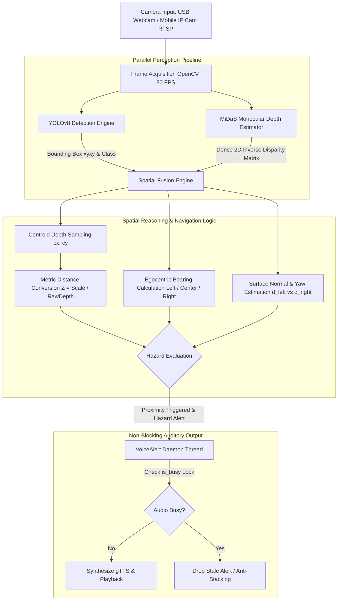

# VisionGuide-Assist: Egocentric Spatial AI Navigation for the Visually Impaired 🚪👁️

<div align="center">

[](https://www.python.org/)
[](https://pytorch.org/)
[](https://github.com/ultralytics/ultralytics)
[](https://opencv.org/)
[](https://github.com/isl-org/MiDaS)
[](https://github.com/Suryansh0402/AutoDoor-DataEngine)
[](LICENSE)
[](#human-impact--accessibility-mission)

**A real-time, low-latency assistive computer vision system fusing custom YOLOv8 object detection, MiDaS monocular depth estimation, and non-blocking auditory spatial feedback to guide visually impaired individuals through indoor environments.**

[Key Features](#-key-features) • [Powered by AutoDoor-DataEngine](#-powered-by-autodoor-dataengine) • [System Architecture](#-system-architecture) • [Mathematical Foundation](#-mathematical-foundation) • [Installation](#-installation--quickstart) • [Usage](#-usage) • [Model Training](#-model-training) • [Roadmap](#-future-roadmap)

</div>

---

## 🎯 Human Impact & Accessibility Mission

Traditional white canes are essential tools for low-vision individuals, but they suffer from a dangerous blindspot: **they only detect ground-level obstacles**. Head-level, chest-level, and mid-air hazards—such as open door leaves, overhead obstacles, and glass barriers—frequently cause collisions and injuries.

Furthermore, traditional distance sensors cannot determine **traversability**:
* Is an obstacle a **closed door** (impassable physical barrier)?
* Or is it an **open doorway** (a safe exit or navigation path)?

**VisionGuide-Assist** operates as an **egocentric spatial AI assistant**. Designed for body-worn or chest-aligned cameras, it continuously monitors the user's forward walking path, detects doors, estimates physical distance without LiDAR, analyzes lateral direction and door orientation, and delivers crisp, prioritized voice guidance in real time.

---

## 🚀 Powered by AutoDoor-DataEngine

Standard door detectors routinely fail in real-world deployments because they are trained on small, biased datasets lacking diverse lighting, perspective angles, and structural door types. Drawing thousands of manual bounding boxes is a severe operational bottleneck.

**VisionGuide-Assist overcomes this data bottleneck using [AutoDoor-DataEngine](https://github.com/Suryansh0402/AutoDoor-DataEngine)**—our automated multimodal data harvesting and VLM pseudo-labeling system:
* **Zero-Shot Visual Grounding:** Uses multimodal Vision-Language Models (Gemini Flash, Grounding DINO) to auto-annotate door bounding boxes from raw indoor footage without manual labeling fatigue.
* **Smart Video Frame Harvesting:** Ingests raw walking walkthrough footage and uses Laplacian variance filtering to prune blurry or redundant frames.
* **Semi-Supervised Teacher–Student Learning:** Scales detector accuracy across thousands of unlabelled indoor scenes using exponential moving average (EMA) teacher pseudo-labeling.
* **Zero-Leakage Group Splitting:** Groups frames by physical building/video to eliminate data leakage between training and validation sets.
* **Knowledge Distillation Ready:** Enables distilling heavy, high-accuracy teacher detectors (YOLOv8m/x) into ultra-fast edge student detectors (YOLOv8n) for deployment on wearable devices.

---

## 🌟 Key Features

* 🚪 **Semantic Door State Recognition:** Custom fine-tuned **YOLOv8** model identifies and classifies doors into `Open` vs. `Closed` with high confidence across diverse indoor scenes and lighting.
* 📏 **LiDAR-Free Metric Depth Estimation:** Employs Intel's **MiDaS** monocular depth estimation neural network to infer dense 3D geometry from standard, single-lens 2D video frames.
* 🧭 **Egocentric Direction & Bearing Analysis:** Divides the camera field-of-view into egocentric navigation zones (*Left*, *Center/Directly Ahead*, *Right*) to provide lateral heading instructions aligned with the user's torso.
* 📐 **Door Pose & Orientation Estimation:** Analyzes spatial depth gradients ($d_{\text{left}}$ vs. $d_{\text{right}}$) across the door surface to estimate approach yaw angle, helping users steer through open door clearings while avoiding protruding door edges.
* ⚡ **Non-Blocking Asynchronous Audio Engine:** Features a custom multi-threaded `VoiceAlert` subsystem with an atomic `is_busy` anti-stacking guard, guaranteeing zero frame drops or latency spikes in the live camera feed during speech synthesis.
* 📱 **Dual Input Modes (Webcam & Mobile IP Cam):** Supports built-in USB webcams as well as wireless RTSP/HTTP video streams from smartphones (e.g., DroidCam, IP Webcam), enabling flexible, wearable edge setups.

---

## 🏗️ System Architecture



---

## 🔬 Mathematical Foundation

### 1. Monocular Inverse Depth to Metric Distance
MiDaS estimates an inverse depth disparity map $\mathcal{D}(x, y)$ from a single RGB image. Given the bounding box centroid $(c_x, c_y)$ of a detected door:
$$c_x = \frac{x_1 + x_2}{2}, \quad c_y = \frac{y_1 + y_2}{2}$$

The metric distance $Z$ (in meters) is derived using an empirical scale calibration factor $k_{\text{depth}}$:
$$Z = \begin{cases} \dfrac{k_{\text{depth}}}{\mathcal{D}(c_y, c_x)} & \text{if } \mathcal{D}(c_y, c_x) > 0 \\ 0 & \text{otherwise} \end{cases}$$

### 2. Egocentric Lateral Bearing
Assuming the camera is aligned with the user's walking vector, the lateral offset normalized to $[-1.0, 1.0]$ across frame width $W$ gives the directional bearing:
$$\text{Bearing} = \frac{c_x - \frac{W}{2}}{\frac{W}{2}}$$

* $\text{Bearing} < -0.25 \implies \textbf{Left Zone}$
* $-0.25 \le \text{Bearing} \le 0.25 \implies \textbf{Directly Ahead / Path Collision Risk}$
* $\text{Bearing} > 0.25 \implies \textbf{Right Zone}$

### 3. Surface Normal & Yaw Angle (Door Slant)
By querying depth along the lateral extents of the door bounding box:
$$\Delta d = \mathcal{D}(c_y, x_2) - \mathcal{D}(c_y, x_1)$$
* $|\Delta d| < \epsilon$: Door is **perpendicular** ($0^\circ$ yaw) $\implies$ Walk straight.
* $\Delta d > \epsilon$: Door plane slopes **away to the right** $\implies$ Adjust path right.
* $\Delta d < -\epsilon$: Door plane slopes **away to the left** $\implies$ Adjust path left.

---

## 📂 Project Structure

```
VisionGuide-Assist/
├── src/
│   ├── main_Webcam.py      # Real-time pipeline using local USB/laptop webcam
│   └── main_IP_Cam.py      # Real-time pipeline connecting to smartphone IP cameras
├── training/
│   └── train_model.py      # Transfer learning training script (YOLOv8 + Roboflow API)
├── docs/
│   └── ARCHITECTURE.md     # In-depth architectural & theoretical documentation
├── requirements.txt        # Python dependency manifest
├── .gitignore              # Git ignore rules for checkpoints & temp media
└── README.md               # Project documentation
```

---

## ⚙️ Installation & Quickstart

### 1. Prerequisites
* **Python 3.8+**
* An NVIDIA GPU with CUDA support (recommended for 30+ FPS, though CPU fallback is fully supported)
* A USB Webcam or a Smartphone on the same local network running an IP Camera app (e.g. *IP Webcam* on Android or *DroidCam*)

### 2. Clone the Repository
```bash
git clone https://github.com/Suryansh0402/VisionGuide-Assist.git
cd VisionGuide-Assist
```

### 3. Create a Virtual Environment & Install Dependencies
```bash
# Create virtual environment
python -m venv venv

# Activate virtual environment
# On Windows:
venv\Scripts\activate
# On Linux/macOS:
source venv/bin/activate

# Install required packages
pip install -r requirements.txt
```

---

## 🚀 Usage

### Mode A: Running with Laptop / USB Webcam
Make sure your model weights `best.pt` are placed in the project root or configure `MODEL_NAME` in [src/main_Webcam.py](file:///c:/Users/surya/Desktop/Projects/VisionGuide-Assist/src/main_Webcam.py):
```bash
python src/main_Webcam.py
```

### Mode B: Running with Smartphone / IP Camera
1. Install an IP Camera app on your smartphone (e.g., **IP Webcam** from Google Play).
2. Connect both your phone and PC to the same Wi-Fi network.
3. Start the camera server on your phone and note the local streaming URL (e.g., `http://192.168.1.15:8080/video`).
4. Update line 87 in [src/main_IP_Cam.py](file:///c:/Users/surya/Desktop/Projects/VisionGuide-Assist/src/main_IP_Cam.py):
   ```python
   cap = cv2.VideoCapture('http://<YOUR_PHONE_IP>:<PORT>/video')
   ```
5. Launch the application:
   ```bash
   python src/main_IP_Cam.py
   ```

---

## 🧠 Model Training

The custom YOLOv8 detector is trained on annotated open/closed door imagery, and continuously scaled and fine-tuned using high-diversity datasets synthesized by [AutoDoor-DataEngine](https://github.com/Suryansh0402/AutoDoor-DataEngine).

To train or reproduce the weights:
```bash
python training/train_model.py
```
Key training parameters:
* **Base Architecture:** `yolov8m.pt` (YOLOv8 Medium for an optimal speed-accuracy tradeoff)
* **Image Size:** $640 \times 640$
* **Epochs:** 200
* **Batch Size:** 8

---

## 🚦 Concurrency & Audio Anti-Stacking Architecture

A critical vulnerability in real-time assistive systems is **speech synthesis lag**:
1. Standard Text-to-Speech (TTS) engines block the main execution thread for 500ms–2000ms while generating and playing audio, dropping video FPS to zero.
2. In rapid detection loops, alerts can queue up, delivering stale warnings seconds after an obstacle was encountered.

**VisionGuide-Assist solves this with a thread-safe singleton audio engine:**
* **Daemonized Background Execution:** Speech is dispatched onto an asynchronous daemon thread (`threading.Thread(daemon=True)`).
* **`is_busy` Atomic State Lock:** If an alert is currently playing, incoming detection cues are safely discarded rather than queued.
* **Collision-Proof Media Lifecycle:** Audio files are generated with microsecond-timestamped randomized hashes (`alert_{timestamp}_{rand}.mp3`) and cleaned up immediately upon playback completion to prevent Windows file locks.

---

## 🗺️ Future Roadmap

- [x] Custom YOLOv8 open/closed door classification
- [x] Monocular metric depth estimation using MiDaS
- [x] Non-blocking multi-threaded TTS voice alerts
- [x] Support for IP cameras and wearable smartphone streams
- [ ] Direct spatial audio panning (binaural 3D audio for left/center/right guidance)
- [ ] TensorRT / ONNX Runtime export for edge deployment on NVIDIA Jetson Orin Nano
- [ ] Integration of haptic vibration feedback for dual-sensory navigation

---

## 📄 License

Distributed under the **MIT License**. See `LICENSE` for details.

---

## 🤝 Acknowledgments

* [Ultralytics](https://github.com/ultralytics/ultralytics) for the YOLOv8 object detection framework.
* [Intel ISL](https://github.com/isl-org/MiDaS) for the MiDaS monocular depth estimation network.
* [Roboflow](https://roboflow.com/) for dataset annotation and distribution infrastructure.
