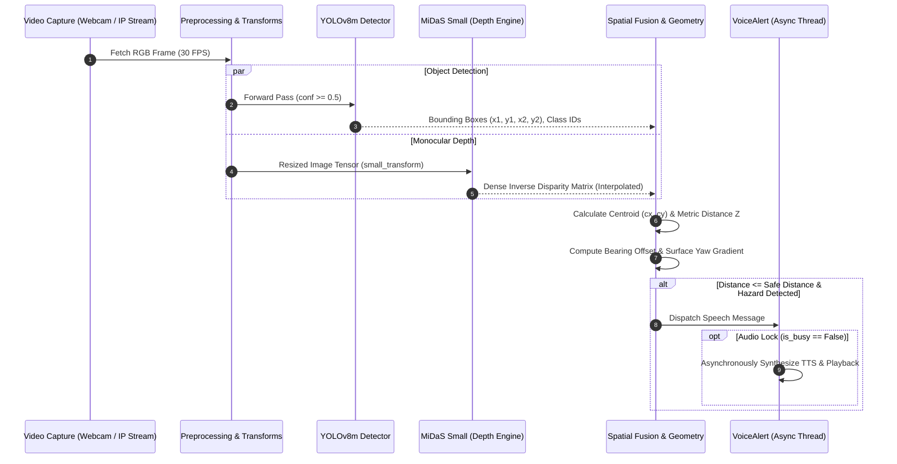

# VisionGuide-Assist: Architectural Deep Dive & Design Document

## 1. System Overview

**VisionGuide-Assist** is an egocentric computer vision perception and spatial guidance system designed for individuals with visual impairments. Powered by the **[AutoDoor-DataEngine](https://github.com/Suryansh0402/AutoDoor-DataEngine)** automated VLM visual harvesting and dataset generation engine, the system solves three primary spatial navigation challenges:

1. **Semantic Categorization:** Distinguishing between open doorways (passable corridors) and closed doors (solid collision obstacles).
2. **LiDAR-Free Range Sensing:** Estimating metric distance using dense monocular inverse disparity maps from a standard RGB video stream.
3. **Egocentric Micro-Navigation:** Translating 2D lateral image coordinates and depth gradients into intuitive, non-visual auditory guidance vectors (*Left*, *Center*, *Right*, and planar surface yaw orientation).

---

## 2. Perception Pipeline & Data Flow



---

## 3. Detailed Component Architecture

### 3.1 Object Detection Subsystem
- **Model:** YOLOv8 Medium (`yolov8m.pt`).
- **Input Resolution:** $640 \times 640$ pixels.
- **Inference Latency:** $\sim 15\text{--}25\text{ ms}$ on modern NVIDIA GPUs (RTX series), $\sim 80\text{--}120\text{ ms}$ on CPU.
- **Classes:**
  - `open`: Identifies doorway openings, doorframes, and open door leaves.
  - `closed`: Identifies fully closed doors and barriers.

### 3.2 Monocular Depth Subsystem
- **Model:** Intel ISL `MiDaS_small` (optimized for lightweight and edge mobile deployment).
- **Processing Flow:**
  1. Input frame converted from BGR to RGB.
  2. Transformed using `midas_transforms.small_transform`.
  3. Evaluated under `torch.no_grad()` to conserve memory and disable autograd graph construction.
  4. Output prediction upsampled back to native frame resolution via bicubic interpolation:
     $$\text{prediction} = \text{interpolate}(\hat{D}, \text{size}=\text{frame.shape}[:2], \text{mode}=\text{"bicubic"})$$

### 3.3 Spatial Geometry & Distance Calibration
Because monocular depth estimation generates relative (affine-invariant) inverse depth rather than absolute metric distance, metric grounding is established through empirical calibration:
$$Z = \frac{k_{\text{depth}}}{\mathcal{D}(c_y, c_x)}$$
where:
- $\mathcal{D}(c_y, c_x)$ is the depth value sampled at the door's 2D bounding-box centroid.
- $k_{\text{depth}}$ is the calibrated scale factor (nominally $400$ for standard desktop/laptop webcam focal lengths).

### 3.4 Directional Bearing & Heading Partitioning
With the camera aligned to the user's torso:
- **Left Zone:** $c_x < 0.33 \times W$
- **Center / Forward Path:** $0.33 \times W \le c_x \le 0.66 \times W$ (Highest risk zone for direct collision)
- **Right Zone:** $c_x > 0.66 \times W$

### 3.5 Surface Yaw Angle & Orientation Analysis
To prevent visually impaired users from colliding with the protruding outer leaf of an open door, depth is evaluated along the left and right borders of the bounding box:
$$\text{Yaw Indicator} = \mathcal{D}_{\text{right}} - \mathcal{D}_{\text{left}}$$
- When the user approaches an open door at an angle, the system determines which side of the passage provides the widest physical clearance.

---

## 4. Concurrency & Thread-Safety Design

```
+-------------------------------------------------------------------+
|                        MAIN THREAD                                |
|  [Frame Capture] -> [YOLOv8 + MiDaS] -> [Spatial Logic] -> [Render]|
+-------------------------------------------------------------------+
                                  |
                   if is_busy == False: spawn daemon thread
                                  v
+-------------------------------------------------------------------+
|                      BACKGROUND THREAD                            |
|  1. Set is_busy = True                                            |
|  2. Generate Unique File: alert_{timestamp}_{rand}.mp3             |
|  3. Call gTTS & Save                                              |
|  4. Play Audio (playsound)                                        |
|  5. Cleanup Temp File                                             |
|  6. Set is_busy = False in 'finally' block                        |
+-------------------------------------------------------------------+
```

### Safety Features:
1. **Zero Main-Loop Blocking:** The main OpenCV loop never stalls for audio synthesis or I/O.
2. **Anti-Stacking Policy:** Discards incoming redundant alert triggers while speech is active, preventing an alert queue pile-up.
3. **Randomized File Descriptors:** Overcomes Windows `ERROR_SHARING_VIOLATION` (file-in-use lock) by generating unique filenames per speech event.
